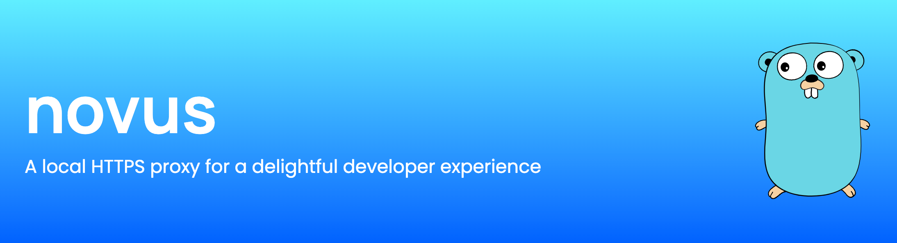
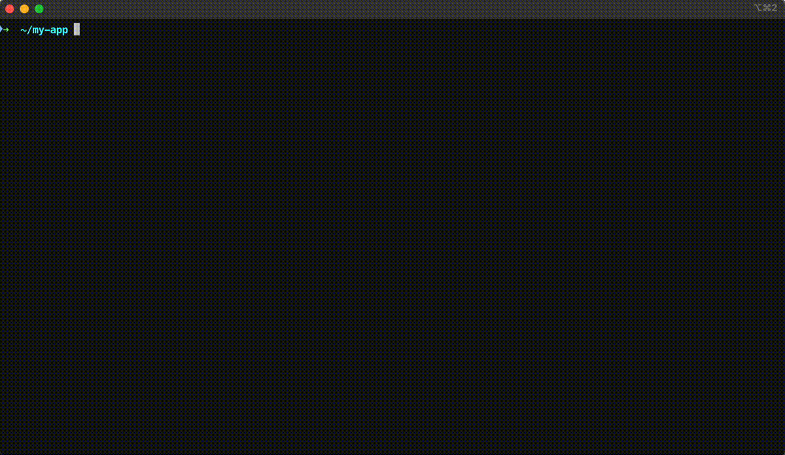

<p align="center">
  
</p>

Novus makes it easy to manage multiple `localhost` services by letting you use **real domain names** instead.<br/>
No more dealing with hard-to-remember ports or editing `/etc/hosts` — just smooth, production-like development on your machine.

Under the hood it’s just good old **Nginx** acting as a proxy and **DNSMasq** for resolving custom domains. SSL certificates are automatically managed and renewed by **mkcert**.

All you need to do is map your `localhost` URLs to domain names - Novus takes care of the rest.

Enjoy hassle-free development with fully secured, real-world URLs! 🎯

<p align="center">
  
</p>

## How to install

Novus can be installed via [Homebrew](https://brew.sh/) in two steps:

```bash
$ brew tap jozefcipa/novus
$ brew install novus
```

After that, you can verify if Novus has been installed properly:

```bash
$ novus -v
```

#### Update Novus
If you are already using Novus, you can update it by running:

```bash
$ brew update
$ brew upgrade novus
```

## How to use

To start using Novus, run `novus init` to install the dependencies and create a configuration file.

Next, open `novus.yml` in your editor to define your domain mapping.

**Example configuration:**

```yaml
appName: my-app
routes:
  - domain: my-frontend.test
    upstream: http://localhost:3000
  - domain: my-api.test
    upstream: http://localhost:4000
    cors: true # Enable CORS for all domains
```

Once you’re done, call `novus serve` and you can use nice HTTPS domains locally 🎉. <br/>

💡 If you want to define _only one_ URL, you can also do this by passing it directly to the `novus serve` command.<br>
👉 (e.g. `novus serve my-api.test http://localhost:3000`)

🔒 Novus will ask for your sudo password (for managing DNS resolvers). If you do not want to type a password every time, run `novus trust`.

## Commands

Here is the list of all available commands.<br/>
You can run them by calling `novus [command]`

| Command | Description |
| ------- | ----------- |
| `init` | Initializes the Novus proxy. Installs the necessary binaries and creates a configuration file (`novus.yml`) |
| `serve [domain?] [upstream?]`  | Reads the configuration file, updates DNS, creates SSL certificates and registers routes. <br><br>**Note:** You can also quickly define one route by providing the configuration directly in the CLI by calling e.g. `novus serve my-api.test http://localhost:3000` |
| `status` | Shows Novus status and all registered apps. |
| `stop` | Disables routing by stopping Nginx and DNSMasq |
| `start` | Starts routing by starting Nginx and DNSMasq |
| `pause [app]` | Pauses routing of a specific app. <br><br> Needed if there are multiple apps defined with conflicting domains |
| `resume [app]` | Starts routing the paused app again. |
| `remove [app\|domain]` | Removes an app configuration from Novus and stops routing. |
| `trust [--revoke?]` | Creates a sudoers record so Novus won't ask for `sudo` password. |

## Notes
💡 **Prefer** `.test` or another postfix that is not a valid TLD domain. <br/>
❌  **Do not use** `.local` domain as it might be [used by MacOS](https://support.apple.com/en-us/101471). <br/>
❌  **Do not use** `.dev` domain either, this is now a valid TLD domain. <br/>

## Contributing
You're more than welcome to contribute to this project! 💙

If you have an **idea**, miss a specific feature or you **found a bug**, feel free to report it or fix it yourself.

If you want to play around, but don't have anything specific, check the [Issues](https://github.com/jozefcipa/novus/issues) page and choose one of the open issues 🙌.

## **License**

Novus is released under the [MIT license](./LICENSE).
